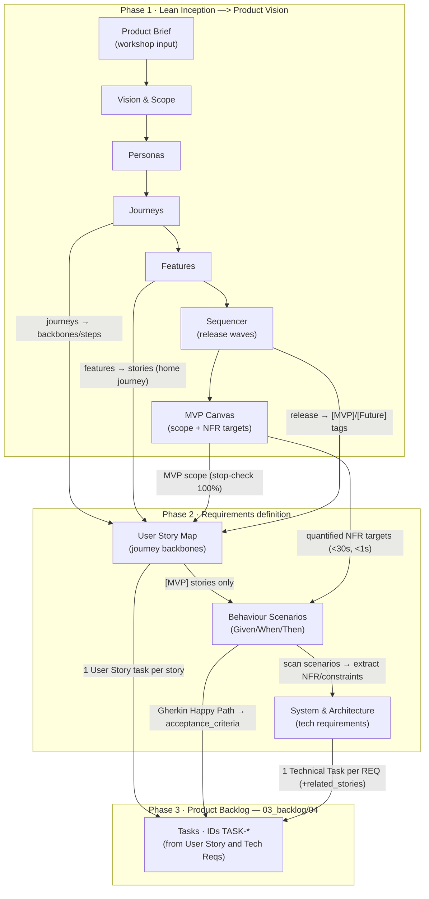
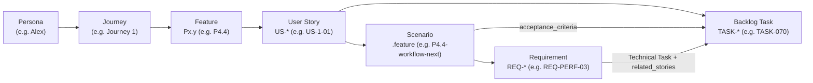

# WingFoil — Design Pipeline Index (Lean Inception → Backlog)

**Purpose:** single entry point to the **documentary chain** that takes WingFoil from a
Lean Inception workshop to an implementation-ready product backlog. It tells you *where*
each phase lives, *when* it was produced, and *how information flows* between phases so the
traceability chain can be followed end to end.

**Last indexed:** (pending execution)

---

## The five phases at a glance

| # | Phase               | Location                                                                        | Index file                                                                                                                    | Produces                                                                        | Stop-Check                                                                           |
|---|---------------------|---------------------------------------------------------------------------------|-------------------------------------------------------------------------------------------------------------------------------|---------------------------------------------------------------------------------|--------------------------------------------------------------------------------------|
| 0 | **Lean Inception**  | [`docs/01_vision/`](01_vision/)                                                 | [`01_vision/00_index.md`](01_vision/00_index.md) · [`01_vision/X_lean-inception-plan.md`](01_vision/X_lean-inception-plan.md) | Product Vision Package (personas, journeys, features, sequencer, MVP canvas)    | Coherence audit ([`01_vision/X_coherence-audit.md`](01_vision/X_coherence-audit.md)) |
| 1 | **User Story Map**  | [`docs/02_requirements/01_user_story_map/`](02_requirements/01_user_story_map/) | [`01_user_story_map/00_index.md`](02_requirements/01_user_story_map/00_index.md)                                              | `[MVP]` stories `US-*` over journey backbones                                   | 100% of MVP features mapped under `[MVP]`                                            |
| 2 | **BDD Suite**       | [`docs/02_requirements/02_bdd/`](02_requirements/02_bdd/)                       | [`02_bdd/00_index.md`](02_requirements/02_bdd/00_index.md)                                                                    | `.feature` files in Gherkin with scenarios                                      | each feature ≥1 nominal + ≥1 error/edge; no ambiguous terms                          |
| 3 | **SARD**            | [`docs/02_requirements/03_sard/`](02_requirements/03_sard/)                     | [`03_sard/00_index.md`](02_requirements/03_sard/00_index.md)                                                                  | Requirements `REQ-*` (SYS/PERF/STATE/INT/SEC)                                   | every `REQ-*` has a measurable Fit Criterion                                         |
| 4 | **Product Backlog** | [`docs/03_backlog/04_backlog/`](03_backlog/04_backlog/)                         | [`04_backlog/00_index.md`](03_backlog/04_backlog/00_index.md)                                                                 | Tasks `TASK-*` (stories + technical)                                            | valid JSON · no duplicate IDs · no circular deps                                     |

> Phases 1–4 are generated from the Phase 0 Product Vision Package; each phase validates 
> its own Stop-Check before the next one starts.

---

## Information flow (how each phase feeds the next)

The chain is **driven by traceable identifiers**. Each artifact carries an ID that the next
phase consumes, so any task can be traced back to the journey and persona it serves.

---

## Traceability chain (identifier lineage)

Follow an ID forward (vision → backlog) or backward (backlog → vision):

**Worked example (forward trace):**
`Alex` → `Journey 1` → feature `P4.4 workflow next` → story `US-1-01`
→ scenario `02_bdd/.../P4.4-workflow-next.feature` → requirement `REQ-PERF-03` (next-step
latency < 1,000 ms) → backlog `TASK-070` (User Story) depending on `TASK-058`
(`REQ-PERF-03` Technical Task).

**Reverse trace (from a task):** open `03_backlog/04_backlog/backlog.json`, read a task's
`ref` (feature or REQ id) and `acceptance_criteria_full` (path to the `.feature`), then
the `.feature` `Feature:` line names the `US-*` and `Px.y`, which the User Story Map maps
to a journey and persona.

---

## Where to find each kind of information

| You need…                                                  | Go to                                                                                           |
|------------------------------------------------------------|-------------------------------------------------------------------------------------------------|
| Vision statement, problem, 5 pillars, GTM                  | `01_vision/01_product-brief.md`, `01_vision/02_product-vision.md`, `01_vision/08_mvp-canvas.md` |
| Personas (pains, goals)                                    | `01_vision/04_personas.md`                                                                      |
| End-to-end user journeys (the backbones)                   | `01_vision/05_journeys.md`                                                                      |
| Feature list + IDs (P1.x…X1.x) + per-release plan          | `01_vision/06_features.md`, `01_vision/07_sequencer.md`                                         |
| CLI command reference                                      | `01_vision/X_cli-cmds.md`                                                                       |
| Which story covers which feature (+ MVP coverage matrix)   | `02_requirements/01_user_story_map/00_index.md`                                                 |
| Acceptance behavior / edge cases per feature               | `02_requirements/02_bdd/features/<pillar>/<Px.y>-*.feature`                                     |
| Non-functional & architectural requirements + Fit Criteria | `02_requirements/03_sard/0*.md`                                                                 |
| Implementation-ready tasks (import to Jira/GitHub)         | `03_backlog/04_backlog/backlog.json` (+ `by-release/`)                                          |
| Backlog task schema                                        | `03_backlog/04_backlog/schema.json`                                                             |

---

## ID conventions (quick reference)

| ID pattern                        | Meaning                            | Defined in                 |
|-----------------------------------|------------------------------------|----------------------------|
| `Px.y` / `X1.y`                   | Feature                            | `01_vision/06_features.md` |
| `US-<journey>-<nn>`               | User Story                         | Phase 1                    |
| `<Px.y>-*.feature`                | BDD feature file / scenarios       | Phase 2                    |
| `REQ-{SYS,PERF,STATE,INT,SEC}-nn` | Requirement                        | Phase 3                    |
| `TASK-001…104`                    | Task (sequential, by release wave) | Phase 4                    |

---

## Note — Task management during bootstrap (dogfooding)

WingFoil is meant to **dogfood itself**: project tasks are ultimately managed as WingFoil
**Memory elements** (`type: task`) governed by the tool's own workflow and state machines.
However, that is not possible until WingFoil is far enough along to be usable.

Therefore the following transition applies:

1. **Bootstrap phase (WingFoil not yet usable):** development is driven by the **static
   tasks defined in the backlog** under [`docs/03_backlog/`](03_backlog/) — i.e.
   `04_backlog/backlog.json` and its `by-release/` slices are the working task list.
2. **Switch-over (as soon as WingFoil is self-hostable):** task management **moves into
   WingFoil**, with tasks tracked as project Memory elements (`.wingfoil/memory/task/…`)
   under WingFoil's own workflow — the product starts managing its own development.
3. **Migration of the remainder (if needed):** any tasks still open in the original backlog
   at switch-over time can then be **transcribed as WingFoil Memory tasks**, preserving
   their traceability (`ref` → feature/`REQ-*`, acceptance criteria) defined in Phase 4.

> In short: `docs/03_backlog/` is the **temporary, file-based source of truth for tasks**
> only until WingFoil can manage its own tasks; after switch-over, the authoritative task
> store is WingFoil Memory, and the static backlog becomes a historical/seed artifact.
