# WingFoil — Workflow Reference

This document describes the complete workflow configuration for the WingFoil project as defined in
`docs/self/.wingfoil/`. The single startable lifecycle is `sw-life-cycle`; three independent
**ingest mains** can be started on demand at any time.

---

## Software Life Cycle — `sw-life-cycle`

The end-to-end lifecycle from product discovery to end-of-life. Inception, specification, init,
and sunset run once; `release-line-cycle` iterates once per major version (v1, v2, ...) and
contains its own `initial-design` + `delivery` sub-phases — reusable as-is when a new major
version starts, without re-running `wingfoil-init`.

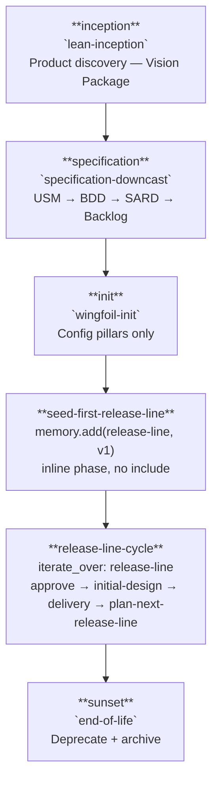

---

## Phase 1 — Inception: `lean-inception`

Five sessions transform the Product Brief into the Vision Package.
Input: `docs/01_vision/01_product-brief.md`.

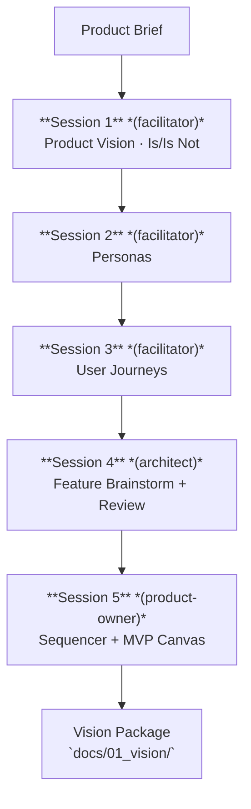

**Outputs:** `product-vision.md`, `is-isnot.md`, `personas.md`, `journeys.md`, `features.md`,
`sequencer.md`, `mvp-canvas.md`.

---

## Phase 2 — Specification: `specification-downcast`

Four modules in strict sequence. Each module ends with a Stop-Check gate before the next begins.
Input: the full Vision Package from Phase 1.

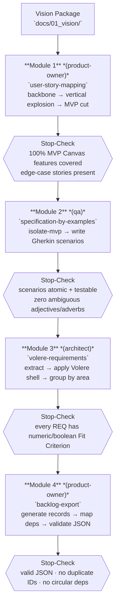

**Outputs:** `docs/02_requirements/01_user_story_map/`, `02_bdd/`, `03_sard/`,
`docs/03_backlog/04_backlog/`.

---

## Phase 3 — Init: `wingfoil-init`

Runs once, ever, between specification and the first release-line. Pure config/tooling bootstrap:
creates the four WingFoil configuration pillars. No Memory content at all — no release roadmap, no
ADRs/Decision Logs/tech-specs; those all moved to `release-line-cycle` (Phase 5) so they can run
again for v2, v3, ... without repeating this phase.

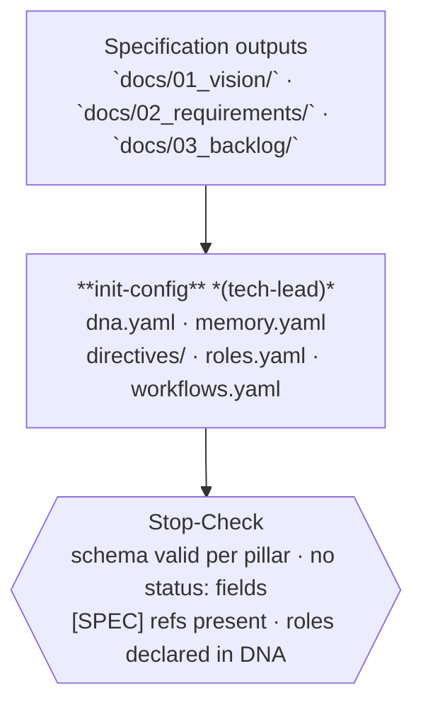

---

## Phase 4 — Seed First Release Line

Runs once, ever, right after init — an inline `sw-life-cycle` phase (no `include:`), since it just
seeds the single input `release-line-cycle` (Phase 5) needs to start.

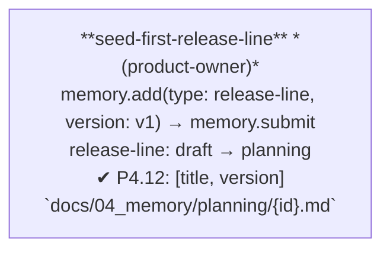

Every *subsequent* release-line (v2, v3, ...) is **self-seeded** instead — by `plan-next-release-line`
at the end of the previous release-line-cycle iteration (Phase 5 below). This is the only place in
the whole config where a workflow creates an element of the same type its own outer loop iterates
over; it fits the existing `iterate_over` + `where` semantics (always a live query against current
Memory state, REQ-SYS-03 — never a fixed snapshot), just not previously exercised this way.

---

## Phase 5 — Release Line: `release-line-cycle`

Iterated once per release-line (`iterate_over: release-line`, `where: status ∈ [planning, active]`).
Composes the release-line-scoped setup (`initial-design`) with the per-release delivery loop
(`delivery`), then closes the release-line and self-seeds the next one.

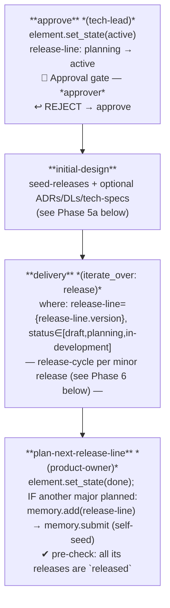

### Phase 5a — Initial Design: `initial-design`

Runs once per release-line-cycle iteration — reusable as-is for v2, v3, ... Generates this
release-line's minor-release roadmap, then records the architecture/product decisions and
artefact specs already implied by it. `seed-releases` is required; the other three are optional.

```mermaid
flowchart TD
    IN2["`approve` output\nrelease-line: active"]

    P2b["**seed-releases** *(product-owner)*\nmemory.add(type: release, release-line: {release-line.version}) × N\nstatus: draft (no pending state)\n✔ P4.12: [title, version, pillar, features, requirements, release-line]\n`docs/04_memory/planning/{release-line}/{id}.md`"]
    SC2b{{"Stop-Check\nN files · all draft\nfeatures list complete per release"}}

    P3["**seed-adrs** *(architect)* · **OPTIONAL**\nmemory.add(type: adr)\ndraft → pending → accepted\n✔ P4.12: [title, sard_ref]\n`docs/04_memory/design/adrs/{id}.md`"]
    SC3{{"Stop-Check\nSARD ref present · Context/Decision/Consequences\nall ADRs status: accepted"}}

    P4["**seed-dls** *(architect)* · **OPTIONAL**\nmemory.add(type: decision-log)\ndraft → pending → approved\n✔ P4.12: [title]\n`docs/04_memory/design/dls/{id}.md`"]
    SC4{{"Stop-Check\nContext/Decision/Consequences\nall DLs status: approved"}}

    P5["**seed-specs** *(architect)* · **OPTIONAL**\nagent.survey_specs (this release-line) → memory.add(type: tech-spec)\ndraft → pending → approved\n✔ P4.12: [title, scope]\n`docs/04_memory/design/specs/{id}.md`"]
    SC5{{"Stop-Check\nnot already covered by an approved spec\nall specs status: approved"}}

    IN2 --> P2b --> SC2b --> P3 --> SC3 --> P4 --> SC4 --> P5 --> SC5

    style P3 fill:#f9f9f9,stroke:#bbb,stroke-dasharray:5 5
    style SC3 fill:#f9f9f9,stroke:#bbb,stroke-dasharray:5 5
    style P4 fill:#f9f9f9,stroke:#bbb,stroke-dasharray:5 5
    style SC4 fill:#f9f9f9,stroke:#bbb,stroke-dasharray:5 5
    style P5 fill:#f9f9f9,stroke:#bbb,stroke-dasharray:5 5
    style SC5 fill:#f9f9f9,stroke:#bbb,stroke-dasharray:5 5
```

`seed-specs` is the release-line-wide sibling of `release-planning`'s `identify-specs` (Phase 6
below): same survey logic, but for artefacts spanning this whole release-line rather than one
release's task scope (e.g. `memory.yaml`'s own schema). `identify-specs` already dedupes against
"not yet covered by an approved spec", so nothing seeded here is re-created once a release's own
delivery starts.

---

## Phase 6 — Delivery: `release-cycle`

Iterated once per release (`iterate_over: release`, `where: release-line = {release-line.version},
status ∈ [draft, planning, in-development]` — scoped to the current release-line-cycle iteration).
Five sub-phases in sequence.

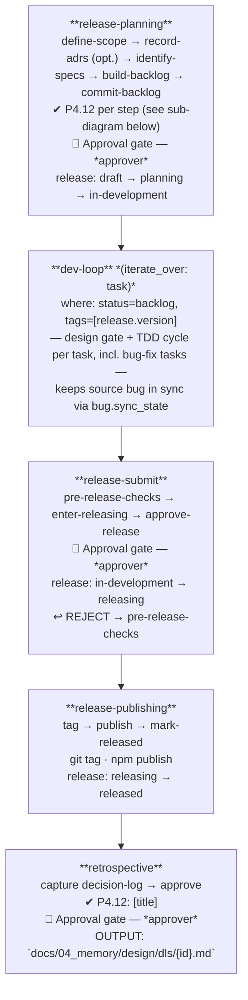

### Dev Loop — `dev-loop`

Iterated once per task (`iterate_over: task`) — including fix tasks derived from bugs. A `design`
gate precedes the TDD red-green-refactor cycle; rejection at review sends the task back to `red`.
Every phase that changes the task's state also calls `bug.sync_state`: a no-op unless the task
carries a `bug:` field, in which case it recomputes the source bug's own state from the aggregate
progress of *all* its derived fix tasks (task and bug share the `in-progress`/`in-review` state
names by design, so no separate bug-fix workflow is needed).

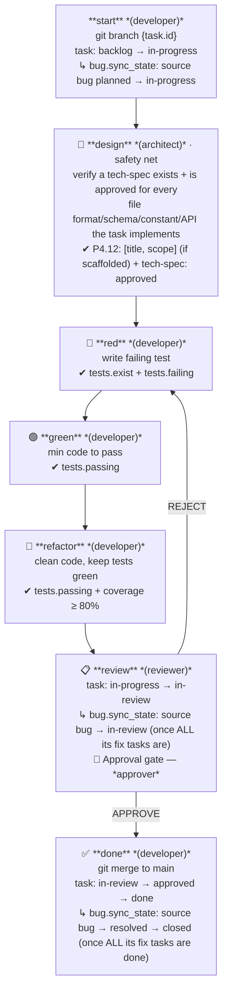

`design` is a fallback: most artefacts should already have an approved tech-spec from
`release-planning`'s `identify-specs` step; this gate only catches artefacts discovered while
implementing the task (detail not predictable at planning time).

### Release Planning — `release-planning`

Five steps in sequence; `record-adrs` is optional. Each `memory.add` step carries a P4.12 check
gate enforcing the required frontmatter fields before the next step begins.

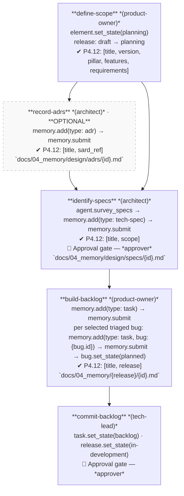

`identify-specs` surveys the release scope for file formats, schemas, constant sets, and module
APIs implied by its tasks, and scaffolds a tech-spec draft for each one not yet covered by an
approved spec — proactively, before `build-backlog` creates the tasks that will implement them.
`dev-loop/design` (above) remains as a reactive fallback for artefacts discovered only during
implementation.

---

## Phase 7 — Sunset: `end-of-life`

Retires the product or a major line. Documents remain in the repository (agents ignore deprecated
content, REQ-STATE-06).

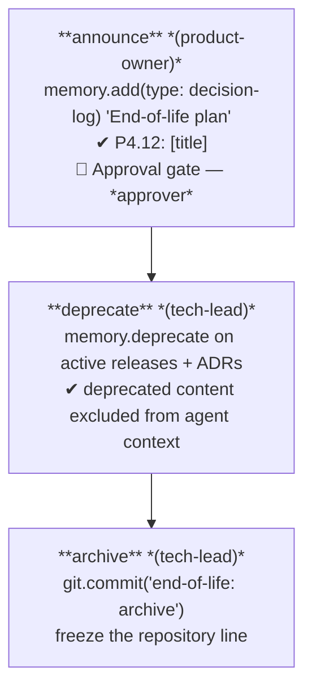

---

## Ingest Mains

Three lightweight `kind: main` workflows startable on demand at any point during the project
(REQ-STATE-03 allows multiple open mains concurrently).

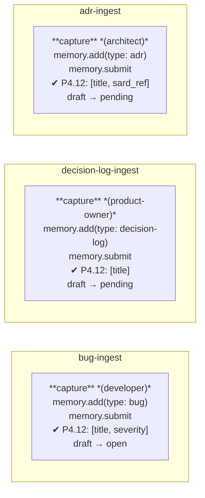

| Workflow | Produces | Typical trigger |
|---|---|---|
| `bug-ingest` | `docs/04_memory/bugs/{id}.md` | Defect found during dev-loop or testing |
| `decision-log-ingest` | `docs/04_memory/design/dls/{id}.md` | Ad-hoc product/process decision |
| `adr-ingest` | `docs/04_memory/design/adrs/{id}.md` | Architectural decision during any phase |

---

## Memory Element State Machines

State is derived from Memory file frontmatter at runtime — no separate state index (REQ-SYS-03).
`memory.deprecate` can be called from any state on any type.

### Release Line

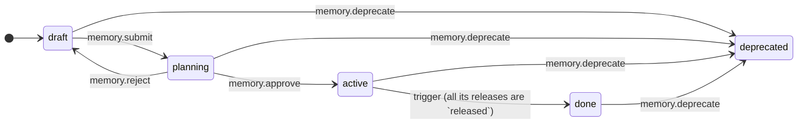

### Release

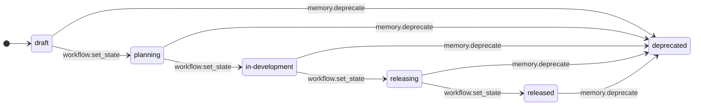

### Task

```mermaid
stateDiagram-v2
    direction LR
    [*] --> draft
    draft --> pending : memory.submit
    pending --> backlog : task.set_state (approved)
    pending --> draft : memory.reject (reopen)
    backlog --> in_progress : workflow.set_state
    in_progress --> in_review : memory.submit
    in_review --> approved : memory.approve
    in_review --> in_progress : memory.reject (back to red)
    approved --> done : workflow.set_state

    in_progress : in-progress
    in_review : in-review
```

### ADR

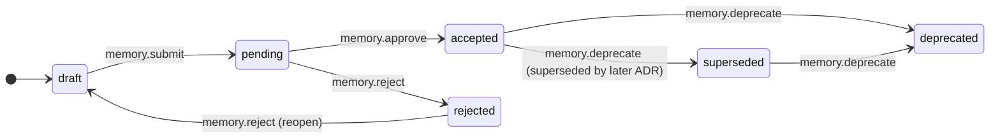

### Tech Spec

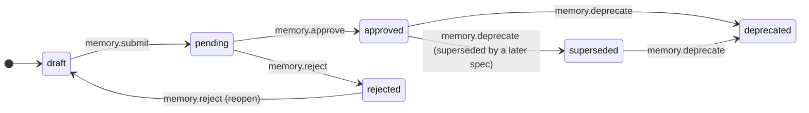

### Decision Log  *(uses default machine)*

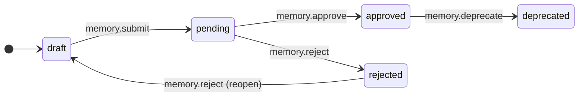

### Bug

```mermaid
stateDiagram-v2
    direction LR
    [*] --> draft
    draft --> open : memory.submit
    open --> triaged : memory.approve
    open --> closed : memory.reject (wontfix / duplicate)
    triaged --> planned : bug.set_state (release-planning/build-backlog, fix task(s) created)
    planned --> in_progress : bug.sync_state (dev-loop, first fix task starts)
    in_progress --> in_review : bug.sync_state (dev-loop, ALL fix tasks in review)
    in_review --> resolved : bug.sync_state (dev-loop, ALL fix tasks done)
    in_review --> in_progress : memory.reject (reopen)
    resolved --> closed : bug.sync_state (dev-loop, ALL fix tasks done)
    resolved --> in_progress : memory.reject (reopen)
    closed --> deprecated : memory.deprecate

    in_progress : in-progress
    in_review : in-review
```

---

## Roles Summary

| Role | Responsibilities in workflows |
|---|---|
| `product-owner` | Release-line seeding/closing (`seed-first-release-line`, `plan-next-release-line`), release-line roadmap (`seed-releases`), release planning, scope definition, backlog creation, retrospective seed |
| `tech-lead` | Config init, release-line approval, backlog approval, release submission and publishing, deprecation |
| `architect` | Features session, Volere requirements, ADR authoring, tech-spec identification/authoring (`identify-specs`, `dev-loop/design`) |
| `developer` | TDD dev-loop (red/green/refactor), branch management, bug capture |
| `reviewer` | Code review in dev-loop |
| `qa` | BDD specification, pre-release checks |
| `facilitator` | Lean inception sessions, retrospective capture |
| `approver` | All approval gates (backlog commit, task review, release, retrospective, end-of-life) |
